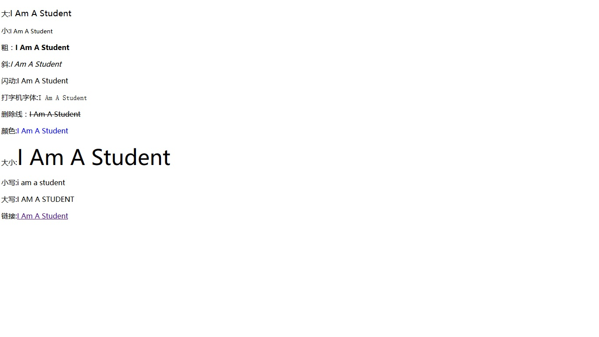

# javascript数字和字符串(三)

## 一、数字

### 1、有小数点
var pi=2.8;

### 2、不使用小数点
var x=27;

### 3、精度

整数（不使用小数点或指数计数法）最多为 15 位。
小数的最大位数是 17，但是浮点运算并不总是 100% 准确


实例：
```javascript
<!DOCTYPE html>
<html>
<meta charset="utf-8">
<body>
<script >
    document.write(x+"</p>");
    x=0.4+0.8;
    document.write(x+"</p>");


    document.write("<p>分别乘以五在相加：")
    x=(4*5+8*5);
    document.write(x+"</p>");
</script>
</body>
</html>
```

实例结果：

4.八进制和十六进制

* 如果前缀是0，那么js会默认数值常量为八进制数
* 如果前缀是0和x，那么为十六进制

实例：
var y=0347;

  var z=0xAE;

## 二、字符串

### 1、计算字符串长度

实例：
```javascript
<!DOCTYPE html>
<html>
<meta charset="utf-8">
<body>
<script >
    var txt="I am a student"
    document.write(txt.length)
</script>
</body>
</html>
```

实例结果：


### 2、为字符串添加样式

实例：
```javascript
<!DOCTYPE html>
<html>
<meta charset="utf-8">
<body>
<script type ="text/javascript" >
    var txt="I Am A Student"

    document.write("<p>大:" + txt.big()+"</p>")

    document.write("<p>小:" + txt.small()+"</p>")

    document.write("<p>粗：" + txt.bold()+"</p>")

    document.write("<p>斜:" + txt.italics()+"</p>")
    
    document.write("<p>闪动:" +txt.blink()+"</p>")//不在ie浏览器显示
    document.write("<p>打字机字体:"+txt.fixed()+"<p>")

    document.write("<p>删除线：" + txt.strike()+"<p>")

    document.write("<p>颜色:"+txt.fontcolor("blue")+"</p>")

    document.write("<p>大小:"+txt.fontsize(8)+"</p>")

    document.write("<p>小写:"+txt.toLowerCase()+"</p>")

    document.write("<p>大写:"+txt.toUpperCase()+"</p>")

    document.write("<p>链接:"+txt.link("http://www.baidu.com")+"</p>")


</script>
</body>
</html>
```
实例结果：



