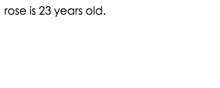
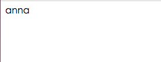

# 关于javascript的学习过程（一）

## 1.Javascript的作用

JS是脚本语言，可直接插入HTML页面的编程代码。在电脑、手机、平板上浏览的所有的网页，以及无数基于HTML5的手机App，交互逻辑都是由JavaScript驱动的。JavaScript能跨平台、跨浏览器驱动网页，与用户交互。

## 2.JS用法

1.通常我们把js的代码放到<head>里,由```<script> ...<.script>```包含的代码就是js的代码

例如：

```
<html>
<head>
  <script>
    alert('Hello, world');
  </script>
</head>
<body>
  ...
</body>
</html>

```

2.把js代码放到一个单独的```.js```文件，然后再从html中通过```<script src="..."></script>```引入这个文件

例如：

```
<html>
<head>
  <script src="../js/1.js"></script>
</head>
<body>
  ...
</body>
</html>
```
这样```../js/1.js```就会被执行

## 3.布尔值

一个布尔值只有```true``` ,```false```两种值

1.```&&```是** 与 **运算（所有结果都为"true"，结果才是"true"）

```
true && true; // 这个&&语句计算结果为true
true && false; // 这个&&语句计算结果为false
false && true && false; // 这个&&语句计算结果为false
```

2.```||```是** 或 **运算（只要有一个是“true”，结果就是“true”）

```
false || false; // 这个||语句计算结果为false
true || false; // 这个||语句计算结果为true
false || true || false; // 这个||语句计算结果为true
```

3.```!```是** 非 **运算（把“true”变成“false”,"false"变成“true”）

```
! true; // 结果为false
! false; // 结果为true
! (2 > 5); // 结果为true
```

## 4.js对象

* 定义并创建对象的实例
* 使用函数来定义对象，然后创建新的对象实例

1.例如：

```javascript
<!DOCTYPE html>
<html>
<head>
	<title></title>
</head>
<body>
<script type="text/javascript">
	person=new Object();
	person.firstname="jack";
	person.lastname="rose";
	person.eyecolor="blue";
	person.age=23;
	document.write(person.firstname + " have " + person.eyecolor +" eyes. ");
</script>
</body>
</html>
```

出现结果如图：


2.例如：

```javascript
<!DOCTYPE html>
<html>
<head>
	<title></title>
</head>
<body>
<script type="text/javascript">
	person=new Object();
	person.firstname="jack";
	person.lastname="rose";
	person.eyecolor="blue";
	person.age=23;
	 document.write(person.lastname + " is " +person.age + " years old. ");
</script> 
</body>
</html>
```


3.注意：这样是显示不出来的，必须要把```lastname```换成```changName```

```javascript
<!DOCTYPE html>
<html>
<body>
<script type="text/javascript">
	function person(firstname,lastname,eyecolor,age)
	{

	this.firstname=firstname;
	this.lastname=lastname;
	this.eyecolor=eyecolor;
	this.age=age;

    function lastname(name)
	{
		this.lastname=name;
	}

	}
	myFriend=new person("tom","jerry","green",24);
	myFriend.lastname("anna");
	document.write(myFriend.lastname);
</script>
</body>
</html>

```


4.要重新定义个对象this.changeName

```javascript
<!DOCTYPE html>
<html>
<body>
<script type="text/javascript">
	function person(firstname,lastname,eyecolor,age)
	{

	this.firstname=firstname;
	this.lastname=lastname;
	this.eyecolor=eyecolor;
	this.age=age;
	this.changeName=changeName;

    function changeName(name)
	{
		this.lastname=name;
	}

	}
	myFriend=new person("tom","jerry","green",24);
	myFriend.changeName("anna");
	document.write(myFriend.lastname);
</script>
</body>
</html>
```

显示结果：




