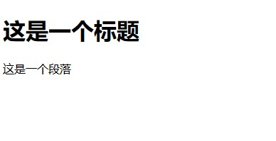
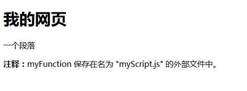

# 关于javascript的使用（二）

## 一、body里的script标签的使用

代码如下：


```javascript
<!DOCTYPE html>
<html>
<meta charset="utf-8">
<body>
<script>
document.write("<h1>这是一个标题</h1>");
document.write("<p>这是一个段落</p>");
</script>
</body>
</html>

```

效果如图：




## 二、javascript函数

### 1、head的js函数

代码如下：

```javascript
<!DOCTYPE html>
<html>
<meta charset="utf-8">
<head>
    <script>
        function myFunction()
        {
            document.getElementById("demo").innerHTML="My First JavaScript Function"
        }
    </script>
</head>
<body>
<h1>网页页面</h1>
</body>
</html>
```

效果如图：


### 2、body的js函数

代码如下：

```javascript

<!DOCTYPE html>
<html>
<meta charset="utf-8">
<body>
<h1>我的网页页面</h1>
<script>
        function myFunction()
        {
            document.getElementById("demo").innerHTML="My First JavaScript Function"
        }
    </script>
</body>
</html>
```

效果如图：


### 3、外部的js文件

```
可以把脚本保存在外部文件中，（外部文件通常包含被多个网页使用的代码。）
外部javascript文件的扩展名是 ".js"
如需使用外部文件，请在<script>标签的“src”属性设置该 .js 文件
```

代码如下：

```javascript

<!DOCTYPE html>
<html>
<meta charset="utf-8">
<body>
<h1>我的网页</h1>
<p>一个段落</p>
<p><b>注释：</b>myFunction 保存在名为 "myScript.js" 的外部文件中。</p>
<script type="text/javascript" src="/js/myScript.js"></script>
</body>
</html>

```

效果如图：

